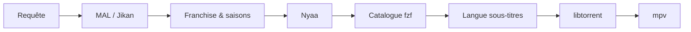

<div align="center">

<pre>
⣿⠛⠛⠛⠛⠻⡆⠀⠀⠀⠀⠀⠀⠀⠀⠀⠀⠀⠀⠀⠀⠀⠀⠀⠀⠀⠀⠀⠀⠀⠀⠀⠀⠀⠀⠀⠀⠀⠀⠀⠀⠀⠀⠀⠀⠀⠀
⠛⢛⣿⠋⢀⡾⠃⠀⠀⠀⠀⢀⣤⣤⠤⠤⣤⣤⣀⣀⣀⣠⠶⡶⣤⣀⣠⠾⡷⣦⣀⣤⣤⡤⠤⠦⢤⣤⣄⡀⠀⢠⡶⢶⡄⠀⠀
⢠⡟⠁⣴⣿⢤⡄⣴⢶⠶⡆⠈⢷⡀⠀⠀⠀⠀⢀⣭⣫⠵⠥⠽⣄⣝⠵⢍⣘⣄⠳⣤⣀⠀⠀⢀⡤⠊⣽⠁⠀⠸⣇⠀⢿⠀⠀
⠸⢷⣴⣤⡤⠾⠇⣽⠋⠼⣷⠀⠈⢷⡄⢀⣤⡶⠋⠀⣀⡄⠤⠀⡲⡆⠀⠀⠈⠙⡄⠘⢮⢳⡴⠯⣀⢠⡏⠀⠀⠀⢻⠀⢸⠇⠀
⠀⠀⠀⠀⠀⠀⠀⠙⠛⠋⠉⢀⣴⠟⠉⢯⡞⡠⢲⠉⣼⠀⠀⡰⠁⡇⢀⢷⠀⣄⢵⠀⠈⡟⢄⠀⠀⠙⢷⣤⣤⣤⡿⢢⡿⠀⠀
⠀⠀⠀⠀⠀⠀⠀⠀⠀⠀⣠⠟⠑⠊⠁⡼⣌⢠⢿⢸⢸⡀⢰⠁⡸⡇⡸⣸⢰⢈⠘⡄⠀⢸⠀⢣⡀⠀⠈⢮⢢⣏⣤⡾⠃⠀⠀
⠀⠀⠀⠀⠀⠀⠀⠀⠀⢰⣯⣴⠞⡠⣼⠁⡘⣾⠏⣿⢇⣳⣸⣞⣀⢱⣧⣋⣞⡜⢳⡇⠀⢸⠀⢆⢧⠀⠰⣄⢏⢧⣾⠁⠀⠀⠀
⠀⠀⠀⠀⠀⠀⠀⠀⠀⠈⢹⡏⢰⠁⡻⠀⡟⡏⠉⠀⣀⠀⠀⠀⠀⣀⠁⠀⠉⠛⢽⠇⠀⣼⡆⠈⡆⠃⠀⡏⠻⣾⣽⣇⡀⠀⠀
⠀⠀⠀⠀⠀⠀⠀⠀⠀⠀⢸⠁⡇⠀⡇⡄⣿⠷⠿⠿⠛⠀⠀⠀⠀⠛⠻⠿⠿⠿⡜⢀⡴⡟⢸⣸⡼⠀⠀⡇⠀⡞⡆⢻⠙⢦⠀
⠀⠀⠀⠀⠀⠀⠀⠀⠀⠀⢸⡶⢀⣼⣿⣬⣽⠧⠬⠇⠀⠀⠀⠀⠀⠀⢞⣯⣭⢺⣔⣪⣾⣤⠺⡇⢳⠀⢠⣧⡾⠛⠛⠻⠶⠞⠁
⠀⠀⠀⠀⠀⠀⠀⠀⠀⠀⠘⠷⢿⠟⠉⡀⠈⢦⡀⠀⠀⣠⠖⠒⠒⢤⡀⠀⢀⡼⠿⢇⡣⢬⣶⠷⢿⣤⡾⠁⠀⠀⠀⠀⠀⠀⠀
⠀⠀⠀⠀⠀⠀⠀⠀⠀⠀⠀⠀⠘⠷⠾⠷⠖⠛⠛⠲⠶⠿⠤⣤⠤⠤⢷⣶⠋⠀⠀⠀⣱⠞⠁⠀⠀⠈⠉⠀⠀⠀⠀⠀⠀⠀⠀⠀
⠀⠀⠀⠀⠀⠀⠀⠀⠀⠀⠀⠀⠀⠀⠀⠀⠀⠀⠀⠀⠀⠀⠀⠀⠀⠀⠀⠉⠛⠓⠒⠚⠋⠀⠀⠀⠀⠀⠀⠀⠀⠀⠀⠀⠀⠀⠀⠀
</pre>

# Annie

**Recherche Nyaa · catalogue MAL · streaming torrent**

CLI pour chercher des anime sur [Nyaa.si](https://nyaa.si), parcourir un catalogue structuré par saisons, choisir une release avec **fzf**, et lire en streaming via **libtorrent** + **mpv** / **vlc** / **ffplay**.

<br>

[](https://www.python.org/downloads/)
[](https://libtorrent.org/)

</div>

---

## Fonctionnalités

| | |
|---|---|
| **Catalogue MAL** | Saisons, épisodes et franchises via l’API Jikan — plus de listes plates |
| **Nyaa intelligent** | Parsing des titres, scoring des releases, batches rattachés à la bonne saison |
| **Interface fzf** | Navigation par anime → saison → épisode → release → langue des sous-titres |
| **Sous-titres** | Téléchargement via [OpenSubtitles.com](https://www.opensubtitles.com) (API) + lecture mpv |
| **Streaming** | Buffer contigu, démarrage rapide (~quelques secondes), lecture pendant le téléchargement |
| **Raccourcis** | `frieren s2e10`, `death note 1 5`, `--batch`, films, OVA, specials |

---

## Prérequis

| Outil | Rôle |
|---|---|
| Python **3.11+** | Runtime |
| [fzf](https://github.com/junegunn/fzf) | Mode interactif |
| **mpv**, **vlc** ou **ffplay** | Lecteur vidéo |
| libtorrent | Installé automatiquement avec le package |

---

## Installation

### Arch Linux (AUR)

```bash
yay -S annie
# ou : paru -S annie
```

Prérequis : `fzf`, lecteur vidéo (`mpv` recommandé). `python-libtorrent` est installé comme dépendance du paquet.

<details>
<summary>Build AUR depuis les sources du dépôt</summary>

```bash
cd packaging/aur
makepkg -si
```

</details>

Pour contribuer ou développer depuis les sources, voir [CONTRIBUTING.md](CONTRIBUTING.md).

---

## Utilisation

### Mode interactif

```bash
./annie.py
```

Tape un titre, navigue dans le catalogue, choisis une release — la lecture démarre.

**Raccourcis dans le prompt :**

| Syntaxe | Action |
|---|---|
| `frieren` | Ouvre le catalogue de l’anime |
| `frieren s2e6` | Saison 2, épisode 6 (puis choix de la langue des sous-titres) |
| `frieren 2 6` | Idem (forme courte) |
| `frieren --batch` | Privilégie les packs saison |

### Ligne de commande

```bash
annie search "frieren" -l 5          # résultats Nyaa classés
annie watch "frieren" -s 2 -e 6 --sub-lang fr   # stream avec sous-titres français
annie play "magnet:?xt=…" -q "01"    # magnet / .torrent direct
annie ls fichier.torrent             # liste les fichiers d’un torrent
```

---

## Configuration

Fichier optionnel : `~/.config/annie/config.toml`

```toml
player = "mpv"                    # auto | mpv | vlc | ffplay
category = "0_0"                  # filtre catégorie Nyaa
filter = "0"                      # filtre Nyaa (0 = tous)
skip_recap_movies = false
preferred_groups = ["Erai-raws"]  # bonus de score pour ces groupes

# Sous-titres externes (OpenSubtitles.com)
subtitles_enabled = true
opensubtitles_api_key = ""        # obligatoire pour les sous-titres
opensubtitles_username = ""       # optionnel : plus de téléchargements / jour
opensubtitles_password = ""
default_sub_lang = ""             # ex. "fr" — saute le fzf langue si défini
```

Variables d’environnement : `ANNIE_PLAYER=mpv`, `OPENSUBTITLES_API_KEY`, `OPENSUBTITLES_USERNAME`, `OPENSUBTITLES_PASSWORD`

### Sous-titres (OpenSubtitles)

Après le choix d’un épisode, Annie propose un **second menu fzf** : English, 中文, हिन्दी, Español, Français, ou **Aucun**. Les sous-titres sont téléchargés en parallèle du buffer torrent et passés à **mpv** (`--sub-file`).

#### Créer une clé API (gratuit)

1. Crée un compte sur [OpenSubtitles.com](https://www.opensubtitles.com) (tu peux [importer un ancien compte .org](https://www.opensubtitles.com/en/import) si tu en avais un).
2. Connecte-toi, puis ouvre **[API consumers](https://www.opensubtitles.com/en/consumers)** (profil → développeurs / API).
3. Clique sur **Create API key** (ou équivalent), donne un nom d’application (ex. `Annie`) et valide.
4. Copie la clé affichée dans `~/.config/annie/config.toml` :

   ```toml
   opensubtitles_api_key = "ta_cle_ici"
   ```

5. *(Recommandé)* Ajoute ton identifiant OpenSubtitles pour augmenter le quota de téléchargements :

   ```toml
   opensubtitles_username = "ton_pseudo"
   opensubtitles_password = "ton_mot_de_passe"
   ```

6. Relance Annie, choisis un épisode, puis une langue dans le menu fzf.

**Limites** (côté OpenSubtitles) : quelques téléchargements/jour sans compte lié ; davantage avec identifiant + clé API. La recherche de sous-titres ne consomme pas de quota de la même façon que le téléchargement.

**Sécurité** : ne commite jamais `config.toml` — il reste dans `~/.config/annie/` sur ta machine uniquement.

### Streaming (`~/.config/annie/settings.toml`)

Créé automatiquement au premier lancement si absent :

```toml
[streaming]
# Partager l'épisode pendant la lecture (upload illimité sur le fichier lu)
seed_while_watching = true
```

Variable d’environnement : `ANNIE_SEED_WHILE_WATCHING=0` pour désactiver.

---

## Flux



---

<div align="center">

<sub>Usage personnel · respecte les lois sur le copyright de ton pays</sub>

</div>
