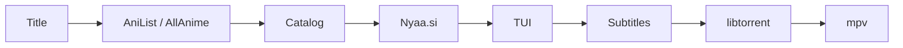

<div align="center">

<pre>
⣿⠛⠛⠛⠛⠻⡆⠀⠀⠀⠀⠀⠀⠀⠀⠀⠀⠀⠀⠀⠀⠀⠀⠀⠀⠀⠀⠀⠀⠀⠀⠀⠀⠀⠀⠀⠀⠀⠀⠀⠀⠀⠀⠀⠀⠀⠀
⠛⢛⣿⠋⢀⡾⠃⠀⠀⠀⠀⢀⣤⣤⠤⠤⣤⣤⣀⣀⣀⣠⠶⡶⣤⣀⣠⠾⡷⣦⣀⣤⣤⡤⠤⠦⢤⣤⣄⡀⠀⢠⡶⢶⡄⠀⠀
⢠⡟⠁⣴⣿⢤⡄⣴⢶⠶⡆⠈⢷⡀⠀⠀⠀⠀⢀⣭⣫⠵⠥⠽⣄⣝⠵⢍⣘⣄⠳⣤⣀⠀⠀⢀⡤⠊⣽⠁⠀⠸⣇⠀⢿⠀⠀
⠸⢷⣴⣤⡤⠾⠇⣽⠋⠼⣷⠀⠈⢷⡄⢀⣤⡶⠋⠀⣀⡄⠤⠀⡲⡆⠀⠀⠈⠙⡄⠘⢮⢳⡴⠯⣀⢠⡏⠀⠀⠀⢻⠀⢸⠇⠀
⠀⠀⠀⠀⠀⠀⠀⠙⠛⠋⠉⢀⣴⠟⠉⢯⡞⡠⢲⠉⣼⠀⠀⡰⠁⡇⢀⢷⠀⣄⢵⠀⠈⡟⢄⠀⠀⠙⢷⣤⣤⣤⡿⢢⡿⠀⠀
⠀⠀⠀⠀⠀⠀⠀⠀⠀⠀⣠⠟⠑⠊⠁⡼⣌⢠⢿⢸⢸⡀⢰⠁⡸⡇⡸⣸⢰⢈⠘⡄⠀⢸⠀⢣⡀⠀⠈⢮⢢⣏⣤⡾⠃⠀⠀
⠀⠀⠀⠀⠀⠀⠀⠀⠀⢰⣯⣴⠞⡠⣼⠁⡘⣾⠏⣿⢇⣳⣸⣞⣀⢱⣧⣋⣞⡜⢳⡇⠀⢸⠀⢆⢧⠀⠰⣄⢏⢧⣾⠁⠀⠀⠀
⠀⠀⠀⠀⠀⠀⠀⠀⠀⠈⢹⡏⢰⠁⡻⠀⡟⡏⠉⠀⣀⠀⠀⠀⠀⣀⠁⠀⠉⠛⢽⠇⠀⣼⡆⠈⡆⠃⠀⡏⠻⣾⣽⣇⡀⠀⠀
⠀⠀⠀⠀⠀⠀⠀⠀⠀⠀⢸⠁⡇⠀⡇⡄⣿⠷⠿⠿⠛⠀⠀⠀⠀⠛⠻⠿⠿⠿⡜⢀⡴⡟⢸⣸⡼⠀⠀⡇⠀⡞⡆⢻⠙⢦⠀
⠀⠀⠀⠀⠀⠀⠀⠀⠀⠀⢸⡶⢀⣼⣿⣬⣽⠧⠬⠇⠀⠀⠀⠀⠀⠀⢞⣯⣭⢺⣔⣪⣾⣤⠺⡇⢳⠀⢠⣧⡾⠛⠛⠻⠶⠞⠁
⠀⠀⠀⠀⠀⠀⠀⠀⠀⠀⠘⠷⢿⠟⠉⡀⠈⢦⡀⠀⠀⣠⠖⠒⠒⢤⡀⠀⢀⡼⠿⢇⡣⢬⣶⠷⢿⣤⡾⠁⠀⠀⠀⠀⠀⠀⠀
⠀⠀⠀⠀⠀⠀⠀⠀⠀⠀⠀⠀⠘⠷⠾⠷⠖⠛⠛⠲⠶⠿⠤⣤⠤⠤⢷⣶⠋⠀⠀⠀⣱⠞⠁⠀⠀⠈⠉⠀⠀⠀⠀⠀⠀⠀⠀⠀
⠀⠀⠀⠀⠀⠀⠀⠀⠀⠀⠀⠀⠀⠀⠀⠀⠀⠀⠀⠀⠀⠀⠀⠀⠀⠀⠀⠉⠛⠓⠒⠚⠋⠀⠀⠀⠀⠀⠀⠀⠀⠀⠀⠀⠀⠀⠀⠀
</pre>

# Annie

**Anime from the terminal — search, pick, play.**

[](https://www.python.org/downloads/)
[](https://libtorrent.org/)

[Install](#install) · [Usage](#usage) · [Shortcuts](#shortcuts) · [Subtitles](#subtitles) · [Troubleshooting](#troubleshooting) · [Config](#configuration)

</div>

---

## Overview

Annie walks you through the full flow:

| Step | Detail |
|------|--------|
| **Catalog** | Seasons and episodes via MyAnimeList |
| **Search** | Best torrents on [Nyaa.si](https://nyaa.si) (seeders, quality, group) |
| **Playback** | Stream while downloading — no full wait |
| **Subtitles** | Optional via OpenSubtitles (mpv) |

UI: in-terminal **TUI** (↑↓, filter, Enter, Esc).

> Personal tool — follow copyright law in your country.

---

## Requirements

| Program | Role | Required |
|---------|------|----------|
| **Annie** | Main CLI | yes |
| **mpv** | Video player | yes |

Without mpv, Annie cannot play. Install it (`sudo pacman -S mpv` or `apt install mpv`).

---

## Install

### Arch Linux

```bash
yay -S annie          # or paru -S annie
sudo pacman -S mpv   # if missing
```

### Linux / macOS (from source)

```bash
git clone https://github.com/CloudDown/annie.git
cd annie
make install
./bin/annie.py
```

Config created on first run: `~/.config/annie/config.toml`

---

## Usage

### Launch

```bash
annie          # after install
./bin/annie.py     # from source
```

ASCII logo → `>` prompt → type a title (**English** or **romaji**, e.g. `frieren`).

### Typical flow

1. **Season** — TUI list, pick e.g. `Season 2`
2. **Episode** — same menu
3. **Subtitles** — language or *None* (if enabled)
4. **Playback** — mpv opens, download continues in the background

During playback:

```
playing      [SubsPlease] … mkv  mpv
ready        22 MiB contiguous
```

Slow connection → `pause  buffer too low` then auto-resume. Quit mpv: **q** or close the window.

At the Annie prompt: `help` · `settings` (shortcut chips under the logo). Ctrl+C to exit.

In the TUI: Omarchy-style shortcut bar · colors follow the terminal theme.

---

## Shortcuts

### Direct search (no menus)

| You type | Result |
|----------|--------|
| `frieren` | Catalog (seasons) |
| `frieren s2` | Season 2 |
| `frieren s2e6` | S02E06 + subtitles |
| `frieren 2 6` | Same (short form) |
| `frieren movie 3` | 3rd movie |
| `frieren --batch` | Prefer season packs |

### In the TUI

| Key | Action |
|-----|--------|
| ↑ / ↓ | Navigate |
| letters | Filter the list |
| **Enter** | Confirm / play |
| **Ctrl-O** | Copy magnet |
| **←** | Previous screen |
| **Esc** | Back / cancel |

---

## Subtitles

Source: [OpenSubtitles.com](https://www.opensubtitles.com) — free API key required.

1. Account on [opensubtitles.com](https://www.opensubtitles.com)
2. [API consumers](https://www.opensubtitles.com/en/consumers) → **Create API key**
3. In Annie, type `settings` — or edit the config:

   Config file: `~/.config/annie/config.toml`

```toml
[subtitles]
enabled = true
api_key = "your_key_here"
username = "your_username"
password = "your_password"
default_lang = "en"    # optional: skip language menu
```

External subtitles require **mpv** only. Do not share this file (password included).

---

## Troubleshooting

<details>
<summary><strong>“interactive mode requires a TTY”</strong></summary>

Run Annie in a real terminal (Alacritty, kitty, GNOME Terminal…), not an IDE button with no console.

</details>

<details>
<summary><strong>“no player found”</strong></summary>

Install mpv: `sudo pacman -S mpv` (or `apt install mpv`).

</details>

<details>
<summary><strong>No subtitles / OpenSubtitles error</strong></summary>

- Check `api_key`, `username`, `password` in `config.toml`
- Player = **mpv** (`[player] command = "mpv"` or `auto`)
- Test the key on the OpenSubtitles site

</details>

<details>
<summary><strong>Stuttering or pauses</strong></summary>

Few seeders or a slow connection. Annie pauses mpv (`buffer too low`) and resumes on its own. Tweak `[buffer]` if needed (see [Configuration](#configuration)).

</details>

<details>
<summary><strong>ASCII logo missing</strong></summary>

```toml
[ui]
show_banner = true
```

</details>

<details>
<summary><strong>No results for my anime</strong></summary>

- Title in **English** or **romaji** (`Made in Abyss`, not a local translation)
- Check your connection
- If MAL is down → Annie falls back to Nyaa only (quiet message)

</details>

---

## Command line

Without interactive menus:

```bash
annie search "frieren" -l 5
annie watch "frieren" -s 2 -e 6
annie watch "frieren" -s 2 -e 6 --sub-lang en
annie play "magnet:?xt=…" -q "01"
annie ls file.torrent
annie watch "…" --no-banner
```

---

## Configuration

Created on **first launch**, never overwritten:

`~/.config/annie/config.toml`

### Minimal example

```toml
[player]
command = "mpv"

[subtitles]
enabled = true
api_key = "your_opensubtitles_key"
default_lang = "en"

[catalog]
preferred_groups = ["SubsPlease", "Erai-raws"]
```

### Common settings

| Section | Key | Effect |
|---------|-----|--------|
| `[player]` | `command` | `auto`, `mpv` |
| `[subtitles]` | `default_lang` | `"en"` = English by default |
| `[subtitles]` | `enabled` | `false` = no subtitle menu |
| `[ui]` | `show_banner` | `false` = no logo |
| `[streaming]` | `seed_while_watching` | seed while watching |
| `[catalog]` | `preferred_groups` | favorite groups |
| `[catalog]` | `preferred_resolution` | `auto`, `720p`, `1080p`, `2160p` |
| `[metadata]` | `mode` | `auto`, `anilist`, `mal`, `off` |

**Environment variables:**

| Variable | Effect |
|----------|--------|
| `ANNIE_PLAYER=mpv` | Force player |
| `ANNIE_METADATA_MODE=off` | Nyaa only (no AniList/MAL) |
| `OPENSUBTITLES_API_KEY=…` | Subtitles API key |
| `ANNIE_SEED_WHILE_WATCHING=0` | No seeding while watching |

<details>
<summary><strong>Full <code>config.toml</code> reference</strong></summary>

Commented template: [`annie/templates/config.toml`](annie/templates/config.toml)

| Section | Notable keys |
|---------|--------------|
| `[player]` | `command` — `auto`, name, or executable path |
| `[player.mpv]` | `cache_secs`, `hwdec`, `extra_args` |
| `[nyaa]` | `category`, `search_pages`, `parallel`, `sort`, `order` |
| `[mal]` | `enabled` — `false` = Nyaa only |
| `[metadata]` | `mode` — `auto`, `anilist`, `mal`, `off` |
| `[catalog]` | `preferred_groups`, `min_seeders_strict`, `fill_gaps_on_search` |
| `[subtitles]` | `enabled`, `default_lang`, `api_key`, `fetch_timeout` |
| `[ui]` | `show_banner`, `show_download_progress`, `seeders_highlight` |
| `[streaming]` / `[buffer]` / `[torrent]` | download, mpv pauses, torrent session |

**Slow connection:**

```toml
[buffer]
max_wait_sec = 8.0
mkv_start_mib = 24
stream_margin_mib = 16
```

Legacy flat keys (`player = "mpv"`) still work; `[…]` sections take precedence.

</details>

---

## Architecture



---

## Developers

[docs/CONTRIBUTING.md](docs/CONTRIBUTING.md) · `make test` (offline unit tests)

---

<div align="center">

**Annie** — personal use

<sub>Follow copyright law in your country.</sub>

</div>
