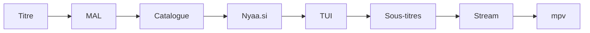

<div align="center">

<pre>
⣿⠛⠛⠛⠛⠻⡆⠀⠀⠀⠀⠀⠀⠀⠀⠀⠀⠀⠀⠀⠀⠀⠀⠀⠀⠀⠀⠀⠀⠀⠀⠀⠀⠀⠀⠀⠀⠀⠀⠀⠀⠀⠀⠀⠀⠀⠀
⠛⢛⣿⠋⢀⡾⠃⠀⠀⠀⠀⢀⣤⣤⠤⠤⣤⣤⣀⣀⣀⣠⠶⡶⣤⣀⣠⠾⡷⣦⣀⣤⣤⡤⠤⠦⢤⣤⣄⡀⠀⢠⡶⢶⡄⠀⠀
⢠⡟⠁⣴⣿⢤⡄⣴⢶⠶⡆⠈⢷⡀⠀⠀⠀⠀⢀⣭⣫⠵⠥⠽⣄⣝⠵⢍⣘⣄⠳⣤⣀⠀⠀⢀⡤⠊⣽⠁⠀⠸⣇⠀⢿⠀⠀
⠸⢷⣴⣤⡤⠾⠇⣽⠋⠼⣷⠀⠈⢷⡄⢀⣤⡶⠋⠀⣀⡄⠤⠀⡲⡆⠀⠀⠈⠙⡄⠘⢮⢳⡴⠯⣀⢠⡏⠀⠀⠀⢻⠀⢸⠇⠀
⠀⠀⠀⠀⠀⠀⠀⠙⠛⠋⠉⢀⣴⠟⠉⢯⡞⡠⢲⠉⣼⠀⠀⡰⠁⡇⢀⢷⠀⣄⢵⠀⠈⡟⢄⠀⠀⠙⢷⣤⣤⣤⡿⢢⡿⠀⠀
⠀⠀⠀⠀⠀⠀⠀⠀⠀⠀⣠⠟⠑⠊⠁⡼⣌⢠⢿⢸⢸⡀⢰⠁⡸⡇⡸⣸⢰⢈⠘⡄⠀⢸⠀⢣⡀⠀⠈⢮⢢⣏⣤⡾⠃⠀⠀
⠀⠀⠀⠀⠀⠀⠀⠀⠀⢰⣯⣴⠞⡠⣼⠁⡘⣾⠏⣿⢇⣳⣸⣞⣀⢱⣧⣋⣞⡜⢳⡇⠀⢸⠀⢆⢧⠀⠰⣄⢏⢧⣾⠁⠀⠀⠀
⠀⠀⠀⠀⠀⠀⠀⠀⠀⠈⢹⡏⢰⠁⡻⠀⡟⡏⠉⠀⣀⠀⠀⠀⠀⣀⠁⠀⠉⠛⢽⠇⠀⣼⡆⠈⡆⠃⠀⡏⠻⣾⣽⣇⡀⠀⠀
⠀⠀⠀⠀⠀⠀⠀⠀⠀⠀⢸⠁⡇⠀⡇⡄⣿⠷⠿⠿⠛⠀⠀⠀⠀⠛⠻⠿⠿⠿⡜⢀⡴⡟⢸⣸⡼⠀⠀⡇⠀⡞⡆⢻⠙⢦⠀
⠀⠀⠀⠀⠀⠀⠀⠀⠀⠀⢸⡶⢀⣼⣿⣬⣽⠧⠬⠇⠀⠀⠀⠀⠀⠀⢞⣯⣭⢺⣔⣪⣾⣤⠺⡇⢳⠀⢠⣧⡾⠛⠛⠻⠶⠞⠁
⠀⠀⠀⠀⠀⠀⠀⠀⠀⠀⠘⠷⢿⠟⠉⡀⠈⢦⡀⠀⠀⣠⠖⠒⠒⢤⡀⠀⢀⡼⠿⢇⡣⢬⣶⠷⢿⣤⡾⠁⠀⠀⠀⠀⠀⠀⠀
⠀⠀⠀⠀⠀⠀⠀⠀⠀⠀⠀⠀⠘⠷⠾⠷⠖⠛⠛⠲⠶⠿⠤⣤⠤⠤⢷⣶⠋⠀⠀⠀⣱⠞⠁⠀⠀⠈⠉⠀⠀⠀⠀⠀⠀⠀⠀⠀
⠀⠀⠀⠀⠀⠀⠀⠀⠀⠀⠀⠀⠀⠀⠀⠀⠀⠀⠀⠀⠀⠀⠀⠀⠀⠀⠀⠉⠛⠓⠒⠚⠋⠀⠀⠀⠀⠀⠀⠀⠀⠀⠀⠀⠀⠀⠀⠀
</pre>

# Annie

**Anime depuis le terminal — recherche, choix, lecture.**

[](https://www.python.org/downloads/)
[](https://libtorrent.org/)

[Installation](#installation) · [Utilisation](#utilisation) · [Raccourcis](#raccourcis) · [Sous-titres](#sous-titres) · [Dépannage](#dépannage) · [Config](#configuration)

</div>

---

## En bref

Annie enchaîne tout le parcours pour toi :

| Étape | Détail |
|-------|--------|
| **Catalogue** | Saisons et épisodes via MyAnimeList |
| **Recherche** | Meilleurs torrents sur [Nyaa.si](https://nyaa.si) (seeders, qualité, groupe) |
| **Lecture** | Streaming pendant le téléchargement — pas d’attente |
| **Sous-titres** | Optionnel via OpenSubtitles (mpv) |

Interface : **TUI** dans le terminal (↑↓, filtre, Entrée, Échap).

> Outil personnel — respecte les lois sur le droit d’auteur de ton pays.

---

## Prérequis

| Programme | Rôle | Requis |
|-----------|------|--------|
| **Annie** | CLI principale | oui |
| **mpv** | Lecteur vidéo | oui* |
| vlc / ffplay | Alternative | optionnel |

\* Sans lecteur, Annie ne peut pas lire. L’installateur Windows installe tout automatiquement.

---

## Installation

### Windows

**Méthode la plus simple** — sans git :

1. GitHub → **Code** → **Download ZIP**
2. Décompresse le dossier
3. Double-clic sur **`install.bat`** (à la racine du dossier)

Le script installe **Python, uv et mpv** s’ils manquent, crée la commande **`annie`** dans ton PATH, et enregistre le lecteur dans `%APPDATA%\annie\config.toml`.

**Avec git :**

```bat
git clone https://github.com/CloudDown/annie.git
cd annie
install.bat
```

| Après install | Commande |
|---------------|----------|
| Terminal courant | `annie` |
| Depuis le dossier projet | `.\bin\annie.cmd` |
| Nouveau terminal | `annie` (PATH mis à jour) |

**Options :** `install.bat -SkipOptional` — n’installe pas mpv automatiquement.

<details>
<summary><strong>Windows — pièges courants</strong></summary>

- **« Python was not found… Microsoft Store »** — Désactive les alias `python.exe` / `python3.exe` dans *Paramètres → Applications → Alias d’exécution d’applications*, puis relance `install.bat`.
- **Ne pas faire** `python -m venv .` à la racine. Utilise **`annie`** ou **`bin\annie.cmd`**, pas `annie.exe` (pip).
- **Lecture ou lecteur introuvable** — Relance `install.bat` (ou `git pull` puis relance si tu as cloné le dépôt).

</details>

### Arch Linux

```bash
yay -S annie          # ou paru -S annie
sudo pacman -S mpv   # si manquant
```

### Linux / macOS (sources)

```bash
git clone https://github.com/CloudDown/annie.git
cd annie
make install
./bin/annie.py
```

Config créée au premier lancement : `~/.config/annie/config.toml`

---

## Utilisation

### Lancer

```bash
annie          # après install
./bin/annie.py     # depuis les sources
```

Logo ASCII → invite `>` → tape un titre (**anglais** ou **romaji**, ex. `frieren`).

### Parcours type

1. **Saison** — liste TUI, choisis ex. `Season 2`
2. **Épisode** — même menu
3. **Sous-titres** — langue ou *Aucun* (si activé)
4. **Lecture** — mpv s’ouvre, téléchargement en arrière-plan

Pendant la lecture :

```
lecture      [SubsPlease] … mkv  mpv
prêt         22 MiB contigu
```

Connexion lente → `pause  buffer insuffisant` puis reprise auto. Quitter mpv : **q** ou fermer la fenêtre.

Au prompt Annie : `help` · `settings` · `quit` (chips sous le logo).

Dans le TUI : barre raccourcis style Omarchy · `?` aide · couleurs = thème du terminal.

---

## Raccourcis

### Recherche directe (sans menus)

| Tu tapes | Résultat |
|----------|----------|
| `frieren` | Catalogue (saisons) |
| `frieren s2` | Saison 2 |
| `frieren s2e6` | S02E06 + sous-titres |
| `frieren 2 6` | Idem (forme courte) |
| `frieren movie 3` | 3ᵉ film |
| `frieren --batch` | Privilégie les packs saison |

### Dans le TUI

| Touche | Action |
|--------|--------|
| ↑ / ↓ | Naviguer |
| lettres | Filtrer la liste |
| **Entrée** | Valider / lire |
| **Ctrl-O** | Copier le magnet |
| **←** | Écran précédent |
| **Échap** | Retour / annuler |

---

## Sous-titres

Source : [OpenSubtitles.com](https://www.opensubtitles.com) — clé API gratuite requise.

1. Compte sur [opensubtitles.com](https://www.opensubtitles.com)
2. [API consumers](https://www.opensubtitles.com/en/consumers) → **Create API key**
3. Dans Annie, tape `settings` — ou édite la config :

   | OS | Fichier |
   |----|---------|
   | Linux | `~/.config/annie/config.toml` |
   | Windows | `%APPDATA%\annie\config.toml` |

```toml
[subtitles]
enabled = true
api_key = "ta_cle_ici"
username = "ton_pseudo"
password = "ton_mot_de_passe"
default_lang = "fr"    # optionnel : saute le menu langue
```

Sous-titres externes = **mpv** uniquement. Ne partage pas ce fichier (mot de passe inclus).

---

## Dépannage

<details>
<summary><strong>« filename or extension is too long » (Windows)</strong></summary>

Certains packs torrent ont des dossiers très longs. Annie utilise des chemins étendus (`\\?\`) pour contourner la limite de 260 caractères. Mets à jour Annie (`git pull` + `install.bat`) si tu vois encore cette erreur.

</details>

<details>
<summary><strong>« interactive mode requires a TTY »</strong></summary>

Lance Annie dans un vrai terminal (Windows Terminal, Alacritty, kitty…), pas un bouton IDE sans console.

</details>

<details>
<summary><strong>« no player found »</strong></summary>

**Windows :** relance `install.bat` — détecte mpv, VLC ou ffplay et écrit le chemin dans `config.toml`.

**Linux :** `sudo pacman -S mpv` (ou `apt install mpv`).

</details>

<details>
<summary><strong>Pas de sous-titres / erreur OpenSubtitles</strong></summary>

- Vérifie `api_key`, `username`, `password` dans `config.toml`
- Lecteur = **mpv** (`[player] command = "mpv"` ou `auto`)
- Teste la clé sur le site OpenSubtitles

</details>

<details>
<summary><strong>Lecture saccadée ou pauses</strong></summary>

Peu de seeders ou connexion lente. Annie met mpv en pause (`buffer insuffisant`) et reprend seul. Ajuste `[buffer]` si besoin (voir [Configuration](#configuration)).

</details>

<details>
<summary><strong>Logo ASCII absent</strong></summary>

```toml
[ui]
show_banner = true
```

</details>

<details>
<summary><strong>Aucun résultat pour mon anime</strong></summary>

- Titre en **anglais** ou **romaji** (`Made in Abyss`, pas la traduction locale)
- Vérifie la connexion
- MAL en panne → Annie bascule sur Nyaa seul (message discret)

</details>

---

## Ligne de commande

Sans menus interactifs :

```bash
annie search "frieren" -l 5
annie watch "frieren" -s 2 -e 6
annie watch "frieren" -s 2 -e 6 --sub-lang fr
annie play "magnet:?xt=…" -q "01"
annie ls fichier.torrent
annie watch "…" --no-banner
```

---

## Configuration

Créée au **premier lancement**, jamais écrasée :

| OS | Emplacement |
|----|-------------|
| Linux / macOS | `~/.config/annie/config.toml` |
| Windows | `%APPDATA%\annie\config.toml` |

### Exemple minimal

```toml
[player]
command = "mpv"

[subtitles]
enabled = true
api_key = "ta_cle_opensubtitles"
default_lang = "fr"

[catalog]
preferred_groups = ["SubsPlease", "Erai-raws"]
```

### Réglages courants

| Section | Clé | Effet |
|---------|-----|--------|
| `[player]` | `command` | `auto`, `mpv`, `vlc`, `ffplay` |
| `[subtitles]` | `default_lang` | `"fr"` = français par défaut |
| `[subtitles]` | `enabled` | `false` = pas de menu sous-titres |
| `[ui]` | `show_banner` | `false` = sans logo |
| `[streaming]` | `seed_while_watching` | seed pendant la lecture |
| `[catalog]` | `preferred_groups` | groupes favoris |
| `[catalog]` | `preferred_resolution` | `auto`, `720p`, `1080p`, `2160p` |
| `[metadata]` | `mode` | `auto`, `anilist`, `mal`, `off` |

**Variables d’environnement :**

| Variable | Effet |
|----------|--------|
| `ANNIE_PLAYER=mpv` | Force le lecteur |
| `ANNIE_METADATA_MODE=off` | Nyaa seul (sans AniList/MAL) |
| `OPENSUBTITLES_API_KEY=…` | Clé API sous-titres |
| `ANNIE_SEED_WHILE_WATCHING=0` | Pas de seed en lecture |

<details>
<summary><strong>Référence complète <code>config.toml</code></strong></summary>

Modèle commenté : [`annie/templates/config.toml`](annie/templates/config.toml)

| Section | Clés notables |
|---------|---------------|
| `[player]` | `command` — `auto`, nom ou chemin exécutable |
| `[player.mpv]` / `[player.vlc]` | `cache_secs`, `hwdec`, `extra_args` |
| `[nyaa]` | `category`, `search_pages`, `parallel`, `sort`, `order` |
| `[mal]` | `enabled` — `false` = Nyaa seul |
| `[metadata]` | `mode` — `auto`, `anilist`, `mal`, `off` |
| `[catalog]` | `preferred_groups`, `min_seeders_strict`, `fill_gaps_on_search` |
| `[subtitles]` | `enabled`, `default_lang`, `api_key`, `fetch_timeout` |
| `[ui]` | `show_banner`, `show_download_progress`, `seeders_highlight` |
| `[streaming]` / `[buffer]` / `[torrent]` | téléchargement, pauses mpv, session torrent |

**Connexion lente :**

```toml
[buffer]
max_wait_sec = 8.0
mkv_start_mib = 24
stream_margin_mib = 16
```

Les anciennes clés plates (`player = "mpv"`) restent supportées ; les sections `[…]` priment.

</details>

---

## Architecture



---

## Développeurs

[docs/CONTRIBUTING.md](docs/CONTRIBUTING.md) · `make test` (tests unitaires hors réseau)

---

<div align="center">

**Annie** — usage personnel

<sub>Respecte les lois sur le droit d’auteur de ton pays.</sub>

</div>
