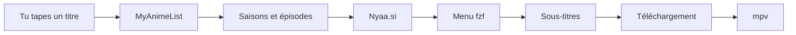

<div align="center">

<pre>
⣿⠛⠛⠛⠛⠻⡆⠀⠀⠀⠀⠀⠀⠀⠀⠀⠀⠀⠀⠀⠀⠀⠀⠀⠀⠀⠀⠀⠀⠀⠀⠀⠀⠀⠀⠀⠀⠀⠀⠀⠀⠀⠀⠀⠀⠀⠀
⠛⢛⣿⠋⢀⡾⠃⠀⠀⠀⠀⢀⣤⣤⠤⠤⣤⣤⣀⣀⣀⣠⠶⡶⣤⣀⣠⠾⡷⣦⣀⣤⣤⡤⠤⠦⢤⣤⣄⡀⠀⢠⡶⢶⡄⠀⠀
⢠⡟⠁⣴⣿⢤⡄⣴⢶⠶⡆⠈⢷⡀⠀⠀⠀⠀⢀⣭⣫⠵⠥⠽⣄⣝⠵⢍⣘⣄⠳⣤⣀⠀⠀⢀⡤⠊⣽⠁⠀⠸⣇⠀⢿⠀⠀
⠸⢷⣴⣤⡤⠾⠇⣽⠋⠼⣷⠀⠈⢷⡄⢀⣤⡶⠋⠀⣀⡄⠤⠀⡲⡆⠀⠀⠈⠙⡄⠘⢮⢳⡴⠯⣀⢠⡏⠀⠀⠀⢻⠀⢸⠇⠀
⠀⠀⠀⠀⠀⠀⠀⠙⠛⠋⠉⢀⣴⠟⠉⢯⡞⡠⢲⠉⣼⠀⠀⡰⠁⡇⢀⢷⠀⣄⢵⠀⠈⡟⢄⠀⠀⠙⢷⣤⣤⣤⡿⢢⡿⠀⠀
⠀⠀⠀⠀⠀⠀⠀⠀⠀⠀⣠⠟⠑⠊⠁⡼⣌⢠⢿⢸⢸⡀⢰⠁⡸⡇⡸⣸⢰⢈⠘⡄⠀⢸⠀⢣⡀⠀⠈⢮⢢⣏⣤⡾⠃⠀⠀
⠀⠀⠀⠀⠀⠀⠀⠀⠀⢰⣯⣴⠞⡠⣼⠁⡘⣾⠏⣿⢇⣳⣸⣞⣀⢱⣧⣋⣞⡜⢳⡇⠀⢸⠀⢆⢧⠀⠰⣄⢏⢧⣾⠁⠀⠀⠀
⠀⠀⠀⠀⠀⠀⠀⠀⠀⠈⢹⡏⢰⠁⡻⠀⡟⡏⠉⠀⣀⠀⠀⠀⠀⣀⠁⠀⠉⠛⢽⠇⠀⣼⡆⠈⡆⠃⠀⡏⠻⣾⣽⣇⡀⠀⠀
⠀⠀⠀⠀⠀⠀⠀⠀⠀⠀⢸⠁⡇⠀⡇⡄⣿⠷⠿⠿⠛⠀⠀⠀⠀⠛⠻⠿⠿⠿⡜⢀⡴⡟⢸⣸⡼⠀⠀⡇⠀⡞⡆⢻⠙⢦⠀
⠀⠀⠀⠀⠀⠀⠀⠀⠀⠀⢸⡶⢀⣼⣿⣬⣽⠧⠬⠇⠀⠀⠀⠀⠀⠀⢞⣯⣭⢺⣔⣪⣾⣤⠺⡇⢳⠀⢠⣧⡾⠛⠛⠻⠶⠞⠁
⠀⠀⠀⠀⠀⠀⠀⠀⠀⠀⠘⠷⢿⠟⠉⡀⠈⢦⡀⠀⠀⣠⠖⠒⠒⢤⡀⠀⢀⡼⠿⢇⡣⢬⣶⠷⢿⣤⡾⠁⠀⠀⠀⠀⠀⠀⠀
⠀⠀⠀⠀⠀⠀⠀⠀⠀⠀⠀⠀⠘⠷⠾⠷⠖⠛⠛⠲⠶⠿⠤⣤⠤⠤⢷⣶⠋⠀⠀⠀⣱⠞⠁⠀⠀⠈⠉⠀⠀⠀⠀⠀⠀⠀⠀⠀
⠀⠀⠀⠀⠀⠀⠀⠀⠀⠀⠀⠀⠀⠀⠀⠀⠀⠀⠀⠀⠀⠀⠀⠀⠀⠀⠀⠉⠛⠓⠒⠚⠋⠀⠀⠀⠀⠀⠀⠀⠀⠀⠀⠀⠀⠀⠀⠀
</pre>

# Annie

**Regarde des anime depuis le terminal — sans site web, sans clic.**

Annie cherche un épisode pour toi, le télécharge au fur et à mesure, et l’ouvre dans ton lecteur vidéo. Tu navigues avec des menus clavier simples.

[](https://www.python.org/downloads/)
[](https://libtorrent.org/)

</div>

---

## C’est quoi Annie ?

Imagine un programme qui fait tout ça pour toi :

1. Tu tapes le nom d’un anime (ex. `frieren`).
2. Annie trouve les saisons et les épisodes (grâce à MyAnimeList).
3. Elle cherche la meilleure version sur [Nyaa.si](https://nyaa.si) (qualité, seeders, groupe de release).
4. Elle lance la lecture **pendant** le téléchargement — pas besoin d’attendre que tout soit fini.
5. Optionnel : elle récupère des **sous-titres** (français, anglais, etc.) et les affiche dans mpv.

Tout se passe dans le **terminal** (la fenêtre noire où on tape des commandes). Les menus de choix utilisent **fzf** : flèches ↑↓, Entrée pour valider, Échap pour revenir.

> **À savoir** : Annie est un outil personnel. Respecte les lois sur le droit d’auteur de ton pays.

---

## Démarrage rapide

### Ce dont tu as besoin

| Programme | À quoi ça sert | Obligatoire ? |
|-----------|------------------|---------------|
| **Annie** | Le programme principal | Oui |
| **fzf** | Les menus de sélection | Oui (mode interactif) |
| **mpv** | Lecteur vidéo (recommandé) | Oui* |
| vlc ou ffplay | Autres lecteurs possibles | Alternative à mpv |

\* Sans lecteur vidéo installé, Annie ne peut pas lire.

### Installation — Arch Linux (le plus simple)

```bash
yay -S annie
# ou : paru -S annie
```

Installe aussi mpv si ce n’est pas déjà fait :

```bash
sudo pacman -S mpv fzf
```

### Installation — depuis les sources (Linux / macOS)

```bash
git clone https://github.com/CloudDown/annie.git
cd annie
make install
./annie.py
```

`make install` crée un environnement Python et un fichier de config dans `~/.config/annie/`.

### Installation — Windows

**Le plus simple (sans git)** : télécharge le projet en ZIP — bouton **Code → Download ZIP** sur GitHub — décompresse-le où tu veux, puis **double-clique sur `install-windows.bat`**. C'est tout : le script installe **Python, uv, fzf et mpv** automatiquement s'ils manquent.

Ou avec git dans un terminal :

```bat
git clone https://github.com/CloudDown/annie.git
cd annie
install-windows.bat
```

L’installateur crée la commande **`annie`** dans le PATH utilisateur, installe les dépendances et **détecte automatiquement** mpv, VLC ou ffplay (winget, Chocolatey, Scoop). Le chemin du lecteur est enregistré dans `%APPDATA%\annie\config.toml`.

Sans réinstaller, depuis le dossier du projet : `.\annie.cmd`

Si Windows affiche *« Python was not found… Microsoft Store »*, désactivez les alias dans  
**Paramètres → Applications → Paramètres avancés → Alias d’exécution d’applications** (désactiver `python.exe` et `python3.exe`), puis relancez l’installateur.

**Important** : n’exécutez pas `python -m venv .` à la racine du dépôt. Utilisez **`annie`** ou **`annie.cmd`** (pas `annie.exe` pip).

Si la lecture échoue, relancez `.\install-windows.bat` après `git pull`.

Options : `install-windows.bat -SkipOptional` pour ne pas installer fzf/mpv automatiquement.

---

## Utiliser Annie (pas à pas)

### 1. Lancer le programme

Ouvre un terminal, puis :

```bash
annie
# ou, depuis les sources :
./annie.py
```

Tu vois le logo ASCII, puis une invite où tu peux taper.

### 2. Chercher un anime

Tape le titre (en anglais ou romaji, c’est en général plus fiable) :

```
frieren
```

Appuie sur **Entrée**. Un court chargement `Searching · ⠹` apparaît pendant la recherche.

### 3. Choisir la saison

Un **menu** s’ouvre (fzf). Utilise :

| Touche | Action |
|--------|--------|
| ↑ / ↓ | Se déplacer |
| **Entrée** | Choisir |
| **Échap** | Annuler / revenir |

Sélectionne par ex. `Season 2`.

### 4. Choisir l’épisode

Même principe : choisis l’épisode voulu.

### 5. Choisir la langue des sous-titres

Si les sous-titres sont activés, un menu propose :

- English, 中文, हिन्दी, Español, **Français**
- ou **Aucun** (sans sous-titres externes)

### 6. Regarder

mpv s’ouvre et la lecture démarre. Pendant le téléchargement tu peux voir :

```
◆ Frieren S02E06 …
sous-titres  episode-fr.srt
lecture      [SubsPlease] … mkv  mpv
prêt         22 MiB contigu
```

Si la connexion ralentit : `⏸ buffer insuffisant` (pause automatique), puis `▶ reprise` quand c’est bon.

Pour quitter mpv : ferme la fenêtre ou appuie sur **q** dans mpv.

### 7. Enchaîner ou quitter

Après l’épisode, tu reviens au prompt Annie. Tape un autre titre, ou :

| Commande | Effet |
|----------|--------|
| `help` | Aide dans le terminal |
| `quit` ou `q` | Quitter Annie (sans message) |

---

## Raccourcis : aller plus vite

Tu peux sauter des menus en tapant tout d’un coup :

| Tu tapes | Ce qui se passe |
|----------|-----------------|
| `frieren` | Ouvre le catalogue (saisons) |
| `frieren s2` | Va directement à la saison 2 |
| `frieren s2e6` | Saison 2, épisode 6 (+ choix sous-titres) |
| `frieren 2 6` | Même chose (forme courte) |
| `frieren movie 3` | Le 3ᵉ film de la franchise |
| `frieren --batch` | Privilégie les packs saison entière |

Dans les menus fzf :

| Touche | Action |
|--------|--------|
| **Entrée** | Lire l’épisode |
| **Ctrl-O** | Copier le lien magnet dans le presse-papiers |
| **Ctrl-N** / **Ctrl-P** | Épisode suivant / précédent |
| **Échap** | Retour |

---

## Sous-titres (configuration une fois)

Les sous-titres viennent de [OpenSubtitles.com](https://www.opensubtitles.com). Il faut une **clé API gratuite** :

1. Crée un compte sur [opensubtitles.com](https://www.opensubtitles.com).
2. Va dans [API consumers](https://www.opensubtitles.com/en/consumers) → **Create API key**.
3. Ouvre le fichier de config :

   **Linux** : `~/.config/annie/config.toml`  
   **Windows** : `%APPDATA%\annie\config.toml`

4. Ajoute ou modifie :

```toml
[subtitles]
enabled = true
api_key = "ta_cle_ici"
username = "ton_pseudo"
password = "ton_mot_de_passe"
default_lang = "fr"    # optionnel : saute le menu langue
```

> Ne partage jamais ce fichier : il contient ton mot de passe OpenSubtitles.

Les sous-titres externes fonctionnent avec **mpv** uniquement.

---

## Problèmes fréquents

<details>
<summary><strong>« fzf not found »</strong></summary>

Installe fzf :

```bash
# Arch
sudo pacman -S fzf

# Debian/Ubuntu
sudo apt install fzf

# Windows
winget install junegunn.fzf
```

</details>

<details>
<summary><strong>« interactive mode requires a TTY »</strong></summary>

Lance Annie dans un vrai terminal (pas depuis un bouton IDE sans console). Sur Windows : PowerShell ou Windows Terminal.

</details>

<details>
<summary><strong>Pas de sous-titres / erreur OpenSubtitles</strong></summary>

- Vérifie `api_key`, `username` et `password` dans `config.toml`.
- Utilise **mpv** comme lecteur (`[player] command = "mpv"`).
- Teste ta clé sur le site OpenSubtitles.

</details>

<details>
<summary><strong>La lecture saccade ou se met en pause</strong></summary>

Connexion lente ou peu de seeders. Annie met mpv en pause automatiquement (`buffer insuffisant`) et reprend quand assez de données sont téléchargées. Tu peux augmenter les délais dans `[buffer]` (voir configuration avancée).

</details>

<details>
<summary><strong>Le logo ASCII ne s’affiche pas</strong></summary>

Dans `config.toml`, vérifie :

```toml
[ui]
show_banner = true
```

</details>

<details>
<summary><strong>Aucun résultat pour mon anime</strong></summary>

- Essaie le titre en **anglais** ou **romaji** (`Made in Abyss` plutôt qu’un titre traduit).
- Vérifie ta connexion internet.
- Si MAL est en panne, Annie bascule sur Nyaa seul (message discret).

</details>

---

## Commandes avancées (ligne de commande)

Pour les utilisateurs à l’aise avec le terminal, sans passer par les menus :

```bash
annie search "frieren" -l 5              # liste des torrents trouvés
annie watch "frieren" -s 2 -e 6          # lire S02E06 directement
annie watch "frieren" -s 2 -e 6 --sub-lang fr
annie play "magnet:?xt=…" -q "01"        # lire un magnet ou .torrent
annie ls fichier.torrent                 # voir les fichiers d’un torrent
annie watch "…" --no-banner              # sans logo au démarrage
```

---

## Configuration

Au **premier lancement**, Annie crée `~/.config/annie/config.toml` (ou `%APPDATA%\annie\` sous Windows). Tu peux l’éditer avec n’importe quel éditeur de texte — Annie ne l’écrase pas.

### Exemple minimal

```toml
[player]
command = "mpv"

[subtitles]
enabled = true
api_key = "ta_cle_opensubtitles"
default_lang = "fr"

[catalog]
preferred_groups = ["SubsPlease", "Erai-raws"]
```

### Réglages utiles au quotidien

| Section | Clé | Effet |
|---------|-----|--------|
| `[player]` | `command` | `auto`, `mpv`, `vlc`, `ffplay` |
| `[subtitles]` | `default_lang` | `"fr"` = sous-titres français par défaut |
| `[subtitles]` | `enabled` | `false` = pas de menu sous-titres |
| `[ui]` | `show_banner` | `false` = pas de logo au démarrage |
| `[streaming]` | `seed_while_watching` | partager l’épisode pendant la lecture |
| `[catalog]` | `preferred_groups` | groupes de release favoris |

Variables d’environnement (remplacent la config) :

| Variable | Effet |
|----------|--------|
| `ANNIE_PLAYER=mpv` | Force le lecteur |
| `OPENSUBTITLES_API_KEY=…` | Clé API sous-titres |
| `ANNIE_SEED_WHILE_WATCHING=0` | Désactive le seed pendant la lecture |

<details>
<summary><strong>Référence complète <code>config.toml</code></strong></summary>

Le modèle commenté avec toutes les clés est dans [`annie/templates/config.toml`](annie/templates/config.toml).

#### `[player]` — lecteur vidéo

| Clé | Défaut | Description |
|-----|--------|-------------|
| `command` | `auto` | `auto`, `mpv`, `vlc`, `ffplay`, ou chemin vers un exécutable |

#### `[player.mpv]` / `[player.vlc]`

Options passées au lecteur (`cache_secs`, `hwdec`, `extra_args`, …).

#### `[nyaa]` — recherches Nyaa.si

| Clé | Défaut | Description |
|-----|--------|-------------|
| `category` | `0_0` | Catégorie anime |
| `search_pages` | `2` | Pages par recherche |
| `parallel` | `10` | Requêtes parallèles |
| `sort` / `order` | `seeders` / `desc` | Tri des résultats |

#### `[mal]` — catalogue MyAnimeList

| Clé | Défaut | Description |
|-----|--------|-------------|
| `enabled` | `true` | `false` = Nyaa seul |

#### `[catalog]` — scoring

| Clé | Défaut | Description |
|-----|--------|-------------|
| `preferred_groups` | `[]` | Groupes favoris |
| `min_seeders_strict` | `10` | Seuil seeders |
| `fill_gaps_on_search` | `false` | Compléter les épisodes manquants |

#### `[subtitles]` — OpenSubtitles

| Clé | Défaut | Description |
|-----|--------|-------------|
| `enabled` | `true` | Menu et téléchargement |
| `default_lang` | `""` | Ex. `"fr"` |
| `api_key` | `""` | Clé API (requise) |
| `fetch_timeout` | `20.0` | Timeout en secondes |

#### `[ui]`

| Clé | Défaut | Description |
|-----|--------|-------------|
| `show_banner` | `true` | Logo ASCII |
| `show_download_progress` | `true` | Barres de téléchargement dans le terminal pendant la lecture mpv |
| `seeders_highlight` | `50` | Seuil couleur verte (search) |

#### `[streaming]` / `[buffer]` / `[torrent]`

Réglages fins du téléchargement, des pauses mpv, et de la session torrent. Voir le template pour les valeurs par défaut.

**Connexion lente — exemple :**

```toml
[buffer]
max_wait_sec = 8.0
mkv_start_mib = 24
stream_margin_mib = 16
```

Les **anciennes clés plates** (`player = "mpv"`, etc.) restent supportées ; les sections `[player]` priment en cas de doublon.

</details>

---

## Comment ça marche (vue d’ensemble)



---

## Développeurs

- Contribuer, tests, packaging : [CONTRIBUTING.md](CONTRIBUTING.md)

```bash
make test          # tests unitaires (hors réseau)
```

---

<div align="center">

**Annie** — usage personnel

<sub>Respecte les lois sur le droit d’auteur de ton pays.</sub>

</div>
