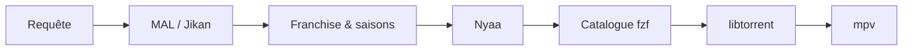

<div align="center">

<pre>
⣿⠛⠛⠛⠛⠻⡆⠀⠀⠀⠀⠀⠀⠀⠀⠀⠀⠀⠀⠀⠀⠀⠀⠀⠀⠀⠀⠀⠀⠀⠀⠀⠀⠀⠀⠀⠀⠀⠀⠀⠀⠀⠀⠀⠀⠀⠀
⠛⢛⣿⠋⢀⡾⠃⠀⠀⠀⠀⢀⣤⣤⠤⠤⣤⣤⣀⣀⣀⣠⠶⡶⣤⣀⣠⠾⡷⣦⣀⣤⣤⡤⠤⠦⢤⣤⣄⡀⠀⢠⡶⢶⡄⠀⠀
⢠⡟⠁⣴⣿⢤⡄⣴⢶⠶⡆⠈⢷⡀⠀⠀⠀⠀⢀⣭⣫⠵⠥⠽⣄⣝⠵⢍⣘⣄⠳⣤⣀⠀⠀⢀⡤⠊⣽⠁⠀⠸⣇⠀⢿⠀⠀
⠸⢷⣴⣤⡤⠾⠇⣽⠋⠼⣷⠀⠈⢷⡄⢀⣤⡶⠋⠀⣀⡄⠤⠀⡲⡆⠀⠀⠈⠙⡄⠘⢮⢳⡴⠯⣀⢠⡏⠀⠀⠀⢻⠀⢸⠇⠀
⠀⠀⠀⠀⠀⠀⠀⠙⠛⠋⠉⢀⣴⠟⠉⢯⡞⡠⢲⠉⣼⠀⠀⡰⠁⡇⢀⢷⠀⣄⢵⠀⠈⡟⢄⠀⠀⠙⢷⣤⣤⣤⡿⢢⡿⠀⠀
⠀⠀⠀⠀⠀⠀⠀⠀⠀⠀⣠⠟⠑⠊⠁⡼⣌⢠⢿⢸⢸⡀⢰⠁⡸⡇⡸⣸⢰⢈⠘⡄⠀⢸⠀⢣⡀⠀⠈⢮⢢⣏⣤⡾⠃⠀⠀
⠀⠀⠀⠀⠀⠀⠀⠀⠀⢰⣯⣴⠞⡠⣼⠁⡘⣾⠏⣿⢇⣳⣸⣞⣀⢱⣧⣋⣞⡜⢳⡇⠀⢸⠀⢆⢧⠀⠰⣄⢏⢧⣾⠁⠀⠀⠀
⠀⠀⠀⠀⠀⠀⠀⠀⠀⠈⢹⡏⢰⠁⡻⠀⡟⡏⠉⠀⣀⠀⠀⠀⠀⣀⠁⠀⠉⠛⢽⠇⠀⣼⡆⠈⡆⠃⠀⡏⠻⣾⣽⣇⡀⠀⠀
⠀⠀⠀⠀⠀⠀⠀⠀⠀⠀⢸⠁⡇⠀⡇⡄⣿⠷⠿⠿⠛⠀⠀⠀⠀⠛⠻⠿⠿⠿⡜⢀⡴⡟⢸⣸⡼⠀⠀⡇⠀⡞⡆⢻⠙⢦⠀
⠀⠀⠀⠀⠀⠀⠀⠀⠀⠀⢸⡶⢀⣼⣿⣬⣽⠧⠬⠇⠀⠀⠀⠀⠀⠀⢞⣯⣭⢺⣔⣪⣾⣤⠺⡇⢳⠀⢠⣧⡾⠛⠛⠻⠶⠞⠁
⠀⠀⠀⠀⠀⠀⠀⠀⠀⠀⠘⠷⢿⠟⠉⡀⠈⢦⡀⠀⠀⣠⠖⠒⠒⢤⡀⠀⢀⡼⠿⢇⡣⢬⣶⠷⢿⣤⡾⠁⠀⠀⠀⠀⠀⠀⠀
⠀⠀⠀⠀⠀⠀⠀⠀⠀⠀⠀⠀⠘⠷⠾⠷⠖⠛⠛⠲⠶⠿⠤⣤⠤⠤⢷⣶⠋⠀⠀⠀⣱⠞⠁⠀⠀⠈⠉⠀⠀⠀⠀⠀⠀⠀⠀⠀
⠀⠀⠀⠀⠀⠀⠀⠀⠀⠀⠀⠀⠀⠀⠀⠀⠀⠀⠀⠀⠀⠀⠀⠀⠀⠀⠀⠉⠛⠓⠒⠚⠋⠀⠀⠀⠀⠀⠀⠀⠀⠀⠀⠀⠀⠀⠀⠀
</pre>

# Annie

**Recherche Nyaa · catalogue MAL · streaming torrent**

CLI pour chercher des anime sur [Nyaa.si](https://nyaa.si), parcourir un catalogue structuré par saisons, choisir une release avec **fzf**, et lire en streaming via **libtorrent** + **mpv** / **vlc** / **ffplay**.

<br>

[](https://www.python.org/downloads/)
[](https://libtorrent.org/)

</div>

---

## Fonctionnalités

| | |
|---|---|
| **Catalogue MAL** | Saisons, épisodes et franchises via l’API Jikan — plus de listes plates |
| **Nyaa intelligent** | Parsing des titres, scoring des releases, batches rattachés à la bonne saison |
| **Interface fzf** | Navigation par anime → saison → épisode → release |
| **Streaming** | Buffer contigu, démarrage rapide (~quelques secondes), lecture pendant le téléchargement |
| **Raccourcis** | `frieren s2e10`, `death note 1 5`, `--batch`, films, OVA, specials |

---

## Prérequis

| Outil | Rôle |
|---|---|
| Python **3.11+** | Runtime |
| [fzf](https://github.com/junegunn/fzf) | Mode interactif |
| **mpv**, **vlc** ou **ffplay** | Lecteur vidéo |
| libtorrent | Installé automatiquement avec le package |

---

## Installation

```bash
git clone https://github.com/CloudDown/annie.git
cd annie
make install
```

<details>
<summary>Installation manuelle</summary>

```bash
python3 -m venv .venv
.venv/bin/pip install -e .
```

</details>

---

## Utilisation

### Mode interactif

```bash
./annie.py
```

Tape un titre, navigue dans le catalogue, choisis une release — la lecture démarre.

**Raccourcis dans le prompt :**

| Syntaxe | Action |
|---|---|
| `frieren` | Ouvre le catalogue de l’anime |
| `frieren s2e6` | Saison 2, épisode 6 |
| `frieren 2 6` | Idem (forme courte) |
| `frieren --batch` | Privilégie les packs saison |

### Ligne de commande

```bash
annie search "frieren" -l 5          # résultats Nyaa classés
annie watch "frieren" -s 2 -e 6      # cherche et stream
annie play "magnet:?xt=…" -q "01"    # magnet / .torrent direct
annie ls fichier.torrent             # liste les fichiers d’un torrent
```

---

## Configuration

Fichier optionnel : `~/.config/annie/config.toml`

```toml
player = "mpv"                    # auto | mpv | vlc | ffplay
category = "0_0"                  # filtre catégorie Nyaa
filter = "0"                      # filtre Nyaa (0 = tous)
skip_recap_movies = false
preferred_groups = ["Erai-raws"]  # bonus de score pour ces groupes
```

Variable d’environnement : `ANNIE_PLAYER=mpv`

---

## Flux



---

## Structure du projet

```
annie.py              Lanceur (active .venv si présent)
annie/
  cli.py              Commandes & boucle interactive
  mal.py              Franchise MAL / Jikan
  media.py            Parsing, scoring, catalogue
  nyaa.py             Client Nyaa & cache
  stream.py           libtorrent + lecteurs
  ui.py               fzf & interface terminal
  cache.py            Cache disque
  preview.py          Aperçus terminal
```

---

## Développement

```bash
make run      # lance le CLI
make clean    # supprime venv & artefacts
```

---

<div align="center">

<sub>Usage personnel · respecte les lois sur le copyright de ton pays</sub>

</div>
