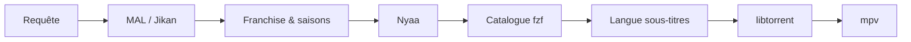

<div align="center">

<pre>
⣿⠛⠛⠛⠛⠻⡆⠀⠀⠀⠀⠀⠀⠀⠀⠀⠀⠀⠀⠀⠀⠀⠀⠀⠀⠀⠀⠀⠀⠀⠀⠀⠀⠀⠀⠀⠀⠀⠀⠀⠀⠀⠀⠀⠀⠀⠀
⠛⢛⣿⠋⢀⡾⠃⠀⠀⠀⠀⢀⣤⣤⠤⠤⣤⣤⣀⣀⣀⣠⠶⡶⣤⣀⣠⠾⡷⣦⣀⣤⣤⡤⠤⠦⢤⣤⣄⡀⠀⢠⡶⢶⡄⠀⠀
⢠⡟⠁⣴⣿⢤⡄⣴⢶⠶⡆⠈⢷⡀⠀⠀⠀⠀⢀⣭⣫⠵⠥⠽⣄⣝⠵⢍⣘⣄⠳⣤⣀⠀⠀⢀⡤⠊⣽⠁⠀⠸⣇⠀⢿⠀⠀
⠸⢷⣴⣤⡤⠾⠇⣽⠋⠼⣷⠀⠈⢷⡄⢀⣤⡶⠋⠀⣀⡄⠤⠀⡲⡆⠀⠀⠈⠙⡄⠘⢮⢳⡴⠯⣀⢠⡏⠀⠀⠀⢻⠀⢸⠇⠀
⠀⠀⠀⠀⠀⠀⠀⠙⠛⠋⠉⢀⣴⠟⠉⢯⡞⡠⢲⠉⣼⠀⠀⡰⠁⡇⢀⢷⠀⣄⢵⠀⠈⡟⢄⠀⠀⠙⢷⣤⣤⣤⡿⢢⡿⠀⠀
⠀⠀⠀⠀⠀⠀⠀⠀⠀⠀⣠⠟⠑⠊⠁⡼⣌⢠⢿⢸⢸⡀⢰⠁⡸⡇⡸⣸⢰⢈⠘⡄⠀⢸⠀⢣⡀⠀⠈⢮⢢⣏⣤⡾⠃⠀⠀
⠀⠀⠀⠀⠀⠀⠀⠀⠀⢰⣯⣴⠞⡠⣼⠁⡘⣾⠏⣿⢇⣳⣸⣞⣀⢱⣧⣋⣞⡜⢳⡇⠀⢸⠀⢆⢧⠀⠰⣄⢏⢧⣾⠁⠀⠀⠀
⠀⠀⠀⠀⠀⠀⠀⠀⠀⠈⢹⡏⢰⠁⡻⠀⡟⡏⠉⠀⣀⠀⠀⠀⠀⣀⠁⠀⠉⠛⢽⠇⠀⣼⡆⠈⡆⠃⠀⡏⠻⣾⣽⣇⡀⠀⠀
⠀⠀⠀⠀⠀⠀⠀⠀⠀⠀⢸⠁⡇⠀⡇⡄⣿⠷⠿⠿⠛⠀⠀⠀⠀⠛⠻⠿⠿⠿⡜⢀⡴⡟⢸⣸⡼⠀⠀⡇⠀⡞⡆⢻⠙⢦⠀
⠀⠀⠀⠀⠀⠀⠀⠀⠀⠀⢸⡶⢀⣼⣿⣬⣽⠧⠬⠇⠀⠀⠀⠀⠀⠀⢞⣯⣭⢺⣔⣪⣾⣤⠺⡇⢳⠀⢠⣧⡾⠛⠛⠻⠶⠞⠁
⠀⠀⠀⠀⠀⠀⠀⠀⠀⠀⠘⠷⢿⠟⠉⡀⠈⢦⡀⠀⠀⣠⠖⠒⠒⢤⡀⠀⢀⡼⠿⢇⡣⢬⣶⠷⢿⣤⡾⠁⠀⠀⠀⠀⠀⠀⠀
⠀⠀⠀⠀⠀⠀⠀⠀⠀⠀⠀⠀⠘⠷⠾⠷⠖⠛⠛⠲⠶⠿⠤⣤⠤⠤⢷⣶⠋⠀⠀⠀⣱⠞⠁⠀⠀⠈⠉⠀⠀⠀⠀⠀⠀⠀⠀⠀
⠀⠀⠀⠀⠀⠀⠀⠀⠀⠀⠀⠀⠀⠀⠀⠀⠀⠀⠀⠀⠀⠀⠀⠀⠀⠀⠀⠉⠛⠓⠒⠚⠋⠀⠀⠀⠀⠀⠀⠀⠀⠀⠀⠀⠀⠀⠀⠀
</pre>

# Annie

**Recherche Nyaa · catalogue MAL · streaming torrent**

CLI pour chercher des anime sur [Nyaa.si](https://nyaa.si), parcourir un catalogue structuré par saisons, choisir une release avec **fzf**, et lire en streaming via **libtorrent** + **mpv** / **vlc** / **ffplay**.

<br>

[](https://www.python.org/downloads/)
[](https://libtorrent.org/)

</div>

---

## Fonctionnalités

| | |
|---|---|
| **Catalogue MAL** | Saisons, épisodes et franchises via l’API Jikan — plus de listes plates |
| **Nyaa intelligent** | Parsing des titres, scoring des releases, batches rattachés à la bonne saison |
| **Interface fzf** | Navigation par anime → saison → épisode → release → langue des sous-titres |
| **Sous-titres** | Téléchargement via [OpenSubtitles.com](https://www.opensubtitles.com) (API) + lecture mpv |
| **Streaming** | Buffer contigu, démarrage rapide (~quelques secondes), lecture pendant le téléchargement |
| **Raccourcis** | `frieren s2e10`, `death note 1 5`, `--batch`, films, OVA, specials |

---

## Prérequis

| Outil | Rôle |
|---|---|
| Python **3.11+** | Runtime |
| [fzf](https://github.com/junegunn/fzf) | Mode interactif |
| **mpv**, **vlc** ou **ffplay** | Lecteur vidéo |
| libtorrent | Installé automatiquement avec le package |

---

## Installation

### Arch Linux (AUR)

```bash
yay -S annie
# ou : paru -S annie
```

Prérequis : `fzf`, lecteur vidéo (`mpv` recommandé). `python-libtorrent` est installé comme dépendance du paquet.

<details>
<summary>Build AUR depuis les sources du dépôt</summary>

```bash
cd packaging/aur
makepkg -si
```

</details>

Pour contribuer ou développer depuis les sources, voir [CONTRIBUTING.md](CONTRIBUTING.md).

### Debian / Ubuntu

**Paquet `.deb` (depuis les sources du dépôt) :**

```bash
sudo apt install python3 python3-pip python3-libtorrent fzf mpv
chmod +x packaging/debian/build-deb.sh
./packaging/debian/build-deb.sh
sudo dpkg -i dist/annie_*_all.deb
```

**Installation développeur (toute plateforme Unix) :**

```bash
# Prérequis : Python 3.11+, fzf, mpv (ou vlc/ffplay), libtorrent
curl -LsSf https://astral.sh/uv/install.sh | sh   # optionnel mais recommandé
make install
./annie.py
```

Les fichiers de configuration sont créés dans `~/.config/annie/` (ou `%APPDATA%\annie\` sous Windows).

### Windows

**PowerShell (depuis les sources) :**

```powershell
# Prérequis : Python 3.11+ dans le PATH
powershell -ExecutionPolicy Bypass -File packaging\windows\install.ps1
.\annie.py
```

Installe aussi **fzf** et **mpv** (recommandés) :

```powershell
winget install junegunn.fzf
winget install mpv.mpv
```

Configuration : `%APPDATA%\annie\` · Cache : `%LOCALAPPDATA%\annie\Cache\`

---

## Utilisation

### Mode interactif

```bash
./annie.py
```

Tape un titre, navigue dans le catalogue, choisis une release — la lecture démarre.

**Raccourcis dans le prompt :**

| Syntaxe | Action |
|---|---|
| `frieren` | Ouvre le catalogue de l’anime |
| `frieren s2e6` | Saison 2, épisode 6 (puis choix de la langue des sous-titres) |
| `frieren 2 6` | Idem (forme courte) |
| `frieren --batch` | Privilégie les packs saison |

### Ligne de commande

```bash
annie search "frieren" -l 5          # résultats Nyaa classés
annie watch "frieren" -s 2 -e 6 --sub-lang fr   # stream avec sous-titres français
annie play "magnet:?xt=…" -q "01"    # magnet / .torrent direct
annie ls fichier.torrent             # liste les fichiers d’un torrent
```

---

## Configuration

Annie lit un seul fichier dans le répertoire de configuration utilisateur :

| Plateforme | Emplacement |
|---|---|
| Linux / Debian | `~/.config/annie/config.toml` |
| Windows | `%APPDATA%\annie\config.toml` |

Il est **créé automatiquement** au premier lancement (ou via `make install` depuis les sources) à partir du modèle du dépôt. Annie **ne l’écrase jamais** : tu peux l’éditer librement.

> **Note :** les anciennes installations avec un `settings.toml` séparé restent supportées — ses valeurs sont lues en complément, `config.toml` primant en cas de doublon.

Le modèle commenté avec toutes les clés est dans `annie/templates/config.toml`.

### Syntaxe TOML

La forme recommandée utilise des **sections** (`[nyaa]`, `[catalog]`, `[streaming]`, …). Les **anciennes clés plates** restent supportées pour compatibilité :

```toml
# Ancien style (toujours valide)
player = "mpv"
category = "0_0"
preferred_groups = ["SubsPlease"]

# Nouveau style (recommandé)
[player]
command = "mpv"

[nyaa]
category = "0_0"
```

Tu peux mélanger les deux ; en cas de doublon, la section structurée prime.

### Variables d’environnement

| Variable | Section | Effet |
|---|---|---|
| `ANNIE_PLAYER` | `[player]` | Remplace `command` |
| `OPENSUBTITLES_API_KEY` | `[subtitles]` | Remplace `api_key` |
| `OPENSUBTITLES_USERNAME` | `[subtitles]` | Remplace `username` |
| `OPENSUBTITLES_PASSWORD` | `[subtitles]` | Remplace `password` |
| `ANNIE_SEED_WHILE_WATCHING` | `[streaming]` | `0` / `false` désactive le seed pendant la lecture |

---

### Référence `config.toml`

#### `[player]` — lecteur vidéo

| Clé | Défaut | Description |
|---|---|---|
| `command` | `auto` | `auto`, `mpv`, `vlc`, `ffplay`, ou chemin vers un exécutable |

`auto` détecte mpv, puis vlc, puis ffplay.

#### `[player.mpv]` et `[player.vlc]`

Options passées au lecteur. Exemple mpv :

| Clé | Défaut | Description |
|---|---|---|
| `cache_secs` | `30` | Cache lecture réseau mpv |
| `hwdec` | `auto-safe` | Décodage matériel (`auto`, `auto-safe`, `no`) |
| `extra_args` | `[]` | Arguments supplémentaires, ex. `["--fs", "--ontop"]` |

VLC : `file_caching_ms`, `network_caching_ms`, `extra_args`.

#### `[nyaa]` — requêtes Nyaa.si

| Clé | Défaut | Description |
|---|---|---|
| `category` | `0_0` | Catégorie Nyaa (`0_0` = anime) |
| `filter` | `0` | Filtre Nyaa (`0` = tous) |
| `search_pages` | `2` | Pages HTML par recherche |
| `parallel` | `10` | Requêtes parallèles lors du build catalogue |
| `rate` / `rate_burst` | `6.0` / `8` | Limite de requêtes/s vers nyaa.si |
| `cache_ttl_minutes` | `45` | Durée du cache disque Nyaa |
| `sort` / `order` | `seeders` / `desc` | Tri des résultats (`seeders`, `size`, `date`, …) |
| `timeout` / `retries` | `30` / `4` | Timeout HTTP et nombre de tentatives |

#### `[mal]` — catalogue MyAnimeList (Jikan)

| Clé | Défaut | Description |
|---|---|---|
| `enabled` | `true` | `false` = Nyaa seul, sans franchise MAL |
| `parallel` | `10` | Requêtes Jikan parallèles |
| `cache_ttl_hours` | `168` | Cache franchise MAL (7 jours) |

#### `[catalog]` — scoring & complétion

| Clé | Défaut | Description |
|---|---|---|
| `preferred_groups` | `[]` | Groupes favoris (ex. `["SubsPlease", "Erai-raws"]`) |
| `preferred_group_bonus` | `10` | Bonus de score pour ces groupes |
| `min_seeders_strict` / `min_seeders_relaxed` | `10` / `3` | Seuils seeders pour filtrer les releases |
| `min_quality_strict` / `min_quality_relaxed` | `26` / `12` | Seuils qualité (~720p / ~480p) |
| `skip_recap_movies` | `false` | Ignorer les films récap MAL |
| `fill_gaps_on_search` | `false` | Compléter les épisodes manquants après une recherche |
| `prefer_season_batch` | `true` | Privilégier un pack saison cohérent plutôt que des singles mélangés |
| `season_batch_min_coverage` | `0.85` | Couverture minimale du pack pour l’adopter |
| `coherence_min_share` | `0.60` | Part minimale d’un même magnet pour harmoniser la saison |

#### `[subtitles]` — OpenSubtitles

| Clé | Défaut | Description |
|---|---|---|
| `enabled` | `true` | Active le menu langue et le téléchargement |
| `default_lang` | `""` | Ex. `"fr"` — saute le menu fzf si défini |
| `api_key` | `""` | Clé API OpenSubtitles (**requise** pour télécharger) |
| `username` / `password` | `""` | Compte OpenSubtitles (quota plus élevé) |
| `fetch_timeout` | `20.0` | Timeout recherche/téléchargement (secondes) |

Après le choix d’un épisode, Annie propose un **menu fzf** : English, 中文, हिन्दी, Español, Français, ou **Aucun**. Les sous-titres sont chargés en parallèle du buffer et passés à **mpv** (`--sub-file`). VLC/ffplay ignorent les sous-titres externes.

**Obtenir une clé API (gratuit) :**

1. Compte sur [OpenSubtitles.com](https://www.opensubtitles.com) ([import .org](https://www.opensubtitles.com/en/import) possible).
2. [API consumers](https://www.opensubtitles.com/en/consumers) → **Create API key**.
3. Dans `~/.config/annie/config.toml` :

   ```toml
   [subtitles]
   enabled = true
   api_key = "ta_cle_ici"
   username = "ton_pseudo"    # recommandé
   password = "ton_mot_de_passe"
   default_lang = "fr"        # optionnel : saute le menu langue
   ```

**Sécurité** : ne commite jamais ce fichier — il reste local dans `~/.config/annie/`.

#### `[ui]` — interface terminal

| Clé | Défaut | Description |
|---|---|---|
| `seeders_highlight` | `50` | Seuil seeders pour le vert dans `annie search` |
| `show_banner` | `true` | Bannière ASCII au démarrage interactif |
| `mal_pool_workers` | `16` | Parallélisme MAL + préchauffage Nyaa |

#### Exemple minimal

```toml
[player]
command = "mpv"

[subtitles]
enabled = true
api_key = "ta_cle_opensubtitles"
default_lang = "fr"

[catalog]
preferred_groups = ["SubsPlease"]
```

#### `[streaming]`

| Clé | Défaut | Description |
|---|---|---|
| `seed_while_watching` | `true` | Partage l’épisode lu (upload prioritaire sur le fichier en cours) |
| `upload_limit_kib` | `512` | Limite upload hors seed (KiB/s) ; `0` = illimité |

#### `[buffer]` — démarrage & pause mpv

| Clé | Défaut | Description |
|---|---|---|
| `max_wait_sec` | `5.0` | Attente du buffer « idéal » avant lecture |
| `no_peers_sec` | `20.0` | Abandon si aucun peer |
| `absolute_sec` | `45.0` | Timeout absolu avant démarrage forcé ou erreur |
| `mkv_start_mib` | `16` | Mo contigus requis pour démarrer un MKV |
| `mkv_head_mib` | `16` | Mo prioritaires en tête de fichier |
| `stream_margin_mib` | `12` | Marge buffer : mpv se met en pause si le téléchargement prend du retard |
| `mpv_retry_sec` | `15.0` | Réessai si mpv échoue au premier lancement |
| `mkv_playable_wait_sec` | `8.0` | Attente supplémentaire pour un MKV lisible |

#### `[torrent]` — session libtorrent

| Clé | Défaut | Description |
|---|---|---|
| `metadata_timeout` | `60.0` | Timeout métadonnées magnet |
| `connections_limit` | `300` | Connexions max |
| `active_downloads` / `active_limit` | `1` / `4` | Slots actifs |
| `enable_dht` / `enable_lsd` / `enable_upnp` / `enable_natpmp` | `true` | Découverte de peers et NAT |

#### Exemple — connexion lente

```toml
[buffer]
max_wait_sec = 8.0
mkv_start_mib = 24
stream_margin_mib = 16

[streaming]
seed_while_watching = true
upload_limit_kib = 256
```

#### Exemple — désactiver le seed

```toml
[streaming]
seed_while_watching = false
```

Ou en une ligne : `ANNIE_SEED_WHILE_WATCHING=0 ./annie.py`

---

## Flux



---

<div align="center">

<sub>Usage personnel · respecte les lois sur le copyright de ton pays</sub>

</div>
