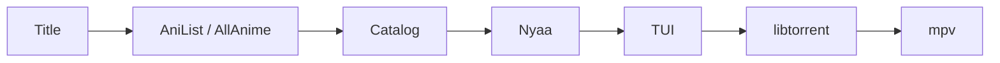

<div align="center">

<pre>
⣿⠛⠛⠛⠛⠻⡆⠀⠀⠀⠀⠀⠀⠀⠀⠀⠀⠀⠀⠀⠀⠀⠀⠀⠀⠀⠀⠀⠀⠀⠀⠀⠀⠀⠀⠀⠀⠀⠀⠀⠀⠀⠀⠀⠀⠀⠀
⠛⢛⣿⠋⢀⡾⠃⠀⠀⠀⠀⢀⣤⣤⠤⠤⣤⣤⣀⣀⣀⣠⠶⡶⣤⣀⣠⠾⡷⣦⣀⣤⣤⡤⠤⠦⢤⣤⣄⡀⠀⢠⡶⢶⡄⠀⠀
⢠⡟⠁⣴⣿⢤⡄⣴⢶⠶⡆⠈⢷⡀⠀⠀⠀⠀⢀⣭⣫⠵⠥⠽⣄⣝⠵⢍⣘⣄⠳⣤⣀⠀⠀⢀⡤⠊⣽⠁⠀⠸⣇⠀⢿⠀⠀
⠸⢷⣴⣤⡤⠾⠇⣽⠋⠼⣷⠀⠈⢷⡄⢀⣤⡶⠋⠀⣀⡄⠤⠀⡲⡆⠀⠀⠈⠙⡄⠘⢮⢳⡴⠯⣀⢠⡏⠀⠀⠀⢻⠀⢸⠇⠀
⠀⠀⠀⠀⠀⠀⠀⠙⠛⠋⠉⢀⣴⠟⠉⢯⡞⡠⢲⠉⣼⠀⠀⡰⠁⡇⢀⢷⠀⣄⢵⠀⠈⡟⢄⠀⠀⠙⢷⣤⣤⣤⡿⢢⡿⠀⠀
⠀⠀⠀⠀⠀⠀⠀⠀⠀⠀⣠⠟⠑⠊⠁⡼⣌⢠⢿⢸⢸⡀⢰⠁⡸⡇⡸⣸⢰⢈⠘⡄⠀⢸⠀⢣⡀⠀⠈⢮⢢⣏⣤⡾⠃⠀⠀
⠀⠀⠀⠀⠀⠀⠀⠀⠀⢰⣯⣴⠞⡠⣼⠁⡘⣾⠏⣿⢇⣳⣸⣞⣀⢱⣧⣋⣞⡜⢳⡇⠀⢸⠀⢆⢧⠀⠰⣄⢏⢧⣾⠁⠀⠀⠀
⠀⠀⠀⠀⠀⠀⠀⠀⠀⠈⢹⡏⢰⠁⡻⠀⡟⡏⠉⠀⣀⠀⠀⠀⠀⣀⠁⠀⠉⠛⢽⠇⠀⣼⡆⠈⡆⠃⠀⡏⠻⣾⣽⣇⡀⠀⠀
⠀⠀⠀⠀⠀⠀⠀⠀⠀⠀⢸⠁⡇⠀⡇⡄⣿⠷⠿⠿⠛⠀⠀⠀⠀⠛⠻⠿⠿⠿⡜⢀⡴⡟⢸⣸⡼⠀⠀⡇⠀⡞⡆⢻⠙⢦⠀
⠀⠀⠀⠀⠀⠀⠀⠀⠀⠀⢸⡶⢀⣼⣿⣬⣽⠧⠬⠇⠀⠀⠀⠀⠀⠀⢞⣯⣭⢺⣔⣪⣾⣤⠺⡇⢳⠀⢠⣧⡾⠛⠛⠻⠶⠞⠁
⠀⠀⠀⠀⠀⠀⠀⠀⠀⠀⠘⠷⢿⠟⠉⡀⠈⢦⡀⠀⠀⣠⠖⠒⠒⢤⡀⠀⢀⡼⠿⢇⡣⢬⣶⠷⢿⣤⡾⠁⠀⠀⠀⠀⠀⠀⠀
⠀⠀⠀⠀⠀⠀⠀⠀⠀⠀⠀⠀⠘⠷⠾⠷⠖⠛⠛⠲⠶⠿⠤⣤⠤⠤⢷⣶⠋⠀⠀⠀⣱⠞⠁⠀⠀⠈⠉⠀⠀⠀⠀⠀⠀⠀⠀⠀
⠀⠀⠀⠀⠀⠀⠀⠀⠀⠀⠀⠀⠀⠀⠀⠀⠀⠀⠀⠀⠀⠀⠀⠀⠀⠀⠀⠉⠛⠓⠒⠚⠋⠀⠀⠀⠀⠀⠀⠀⠀⠀⠀⠀⠀⠀⠀⠀
</pre>

# Annie

**Anime from the terminal — search, pick, stream in mpv.**

[Install](#install) · [Launch](#launch) · [Usage](#usage) · [Config](#configuration)

</div>

Search [Nyaa](https://nyaa.si), pick a season/episode in a TUI, play while it downloads. Catalog from AniList / AllAnime. Optional [OpenSubtitles](https://www.opensubtitles.com).

> Personal tool — follow copyright law in your country.

---

## Install

### Omarchy (easy)

One command — deps, binary, app launcher, **Super+Shift+A**:

```bash
curl -fsSL https://raw.githubusercontent.com/CloudDown/annie/master/install-omarchy.sh | bash
```

Already cloned this repo? Same result:

```bash
make omarchy
```

Then:

| | |
|---|---|
| **Super+Shift+A** | Open / focus Annie |
| **Super+Space** | Type `annie` or `anime` |
| **Super+Alt+Space** | Apps → Annie |
| Terminal | `annie` |

Same wiring as btop / Docker (`xdg-terminal-exec`, floating TUI). mpv floats on top.

Note: **Super+Shift+A** was ChatGPT (still in Apps). Grok stays on **Super+Shift+Alt+A**.

### Arch Linux

```bash
yay -S annie          # or: omarchy pkg aur add annie
sudo pacman -S mpv    # if missing
```

AUR ships the CLI + `.desktop`. For Super+Shift+A and the floating window, run `make omarchy` from a git clone.

### From source (any Linux)

Needs [uv](https://docs.astral.sh/uv/) and **mpv**.

```bash
git clone https://github.com/CloudDown/annie.git
cd annie
make install          # uv sync + ~/.local/bin/annie + config.toml
annie
```

---

## Launch

Type a title in **English** or **romaji** (`frieren`, `made in abyss`).

1. Pick a season → episode → optional subtitles  
2. mpv opens; the torrent keeps downloading  
3. Slow swarm → `pause  buffer too low`, then auto-resume  
4. Quit mpv with **q**

Prompt chips: `help` · `settings`. Ctrl+C to leave Annie. Colors follow the terminal theme.

```
playing      [SubsPlease] … mkv  mpv
ready        22 MiB contiguous
```

---

## Usage

Skip menus by typing the target:

| You type | Result |
|----------|--------|
| `frieren` | Catalog (seasons) |
| `frieren s2` | Season 2 |
| `frieren s2e6` | S02E06 + subtitles |
| `frieren 2 6` | Same (short form) |
| `frieren movie 3` | 3rd movie |
| `frieren --batch` | Prefer season packs |

TUI: **↑↓** move · type to filter · **Enter** play · **Ctrl-O** copy magnet · **←** / **Esc** back.

CLI without the prompt:

```bash
annie search "frieren" -l 5
annie watch "frieren" -s 2 -e 6
annie watch "frieren" -s 2 -e 6 --sub-lang en
annie play "magnet:?xt=…" -q "01"
annie ls file.torrent
```

---

## Subtitles

[OpenSubtitles.com](https://www.opensubtitles.com) — free API key.

1. Create a key under [API consumers](https://www.opensubtitles.com/en/consumers)  
2. In Annie: `settings`, or edit `~/.config/annie/config.toml`

```toml
[subtitles]
enabled = true
api_key = "your_key_here"
username = "your_username"
password = "your_password"
default_lang = "en"    # skip the language menu
```

Needs **mpv**. Don’t share this file (it contains the password).

---

## Configuration

Created on first launch, never overwritten: `~/.config/annie/config.toml`

```toml
[player]
command = "mpv"

[subtitles]
enabled = true
api_key = ""
default_lang = "en"

[catalog]
preferred_groups = ["SubsPlease", "Erai-raws"]
preferred_resolution = "1080p"
```

| Section | Key | Effect |
|---------|-----|--------|
| `[player]` | `command` | `auto` or `mpv` |
| `[subtitles]` | `default_lang` | e.g. `"en"` |
| `[ui]` | `show_banner` | `false` hides the logo |
| `[streaming]` | `seed_while_watching` | seed while playing |
| `[catalog]` | `preferred_groups` | extra score for these teams |
| `[metadata]` | `mode` | `auto`, `anilist`, `mal`, `off` |

Env: `ANNIE_PLAYER`, `ANNIE_METADATA_MODE=off`, `OPENSUBTITLES_API_KEY`, `ANNIE_SEED_WHILE_WATCHING=0`.

<details>
<summary><strong>Full <code>config.toml</code></strong></summary>

Template: [`annie/templates/config.toml`](annie/templates/config.toml)

Slow connection:

```toml
[buffer]
max_wait_sec = 8.0
mkv_start_mib = 24
stream_margin_mib = 16
```

Legacy flat keys (`player = "mpv"`) still work.

</details>

---

## Troubleshooting

| Problem | Fix |
|---------|-----|
| `interactive mode requires a TTY` | Run in a real terminal, not a headless IDE task |
| `no player found` | `sudo pacman -S mpv` |
| No subtitles | Check `api_key` / `username` / `password` in `config.toml` |
| Stutter / pause | Weak swarm — Annie pauses on `buffer too low` by itself |
| No results | English or romaji title; MAL down → Nyaa-only fallback |

---

## Developers

[docs/CONTRIBUTING.md](docs/CONTRIBUTING.md) · `make test`



---

<div align="center">

**Annie** — personal use · follow copyright law in your country

</div>
